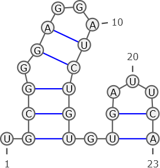
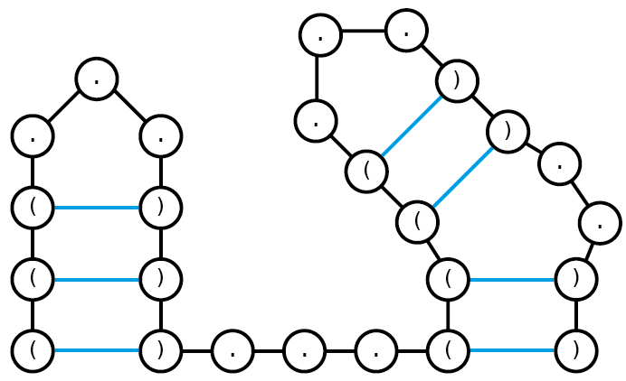
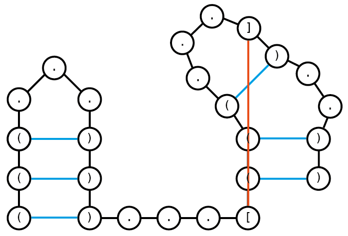
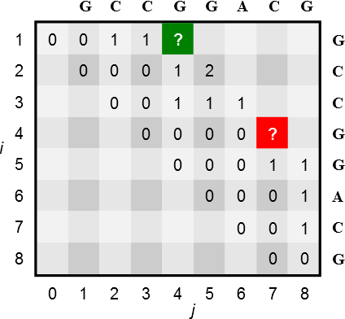
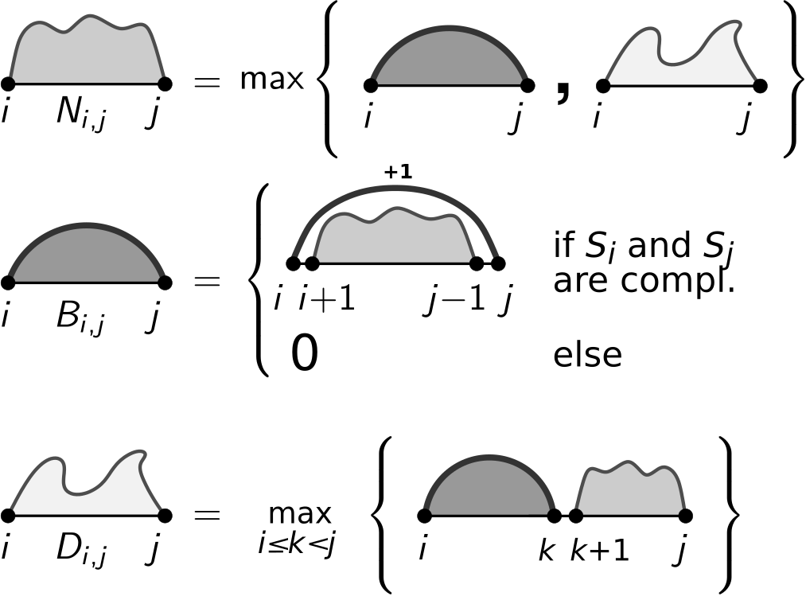

```{r, include=FALSE}
source("custom_functions.R")
library(flextable)
library(officer)

```

---
title: "Exercise sheet 11: RNA Bioinformatics"
---

---------------------------------

# Exercise 1

RNA secondary structures can be represented using a graph notation, where nodes represent nucleotides and edges encode the molecule's backbone or intramolecular base pairs between nucleotides. Below, an RNA molecule graph is depicted that encodes base pairs in blue.

Decide for the following properties whether they are correct or wrong given the RNA secondary structure graph.

```{r, echo=FALSE, out.width="40%", fig.align='center'}

```


### 1a)
::: {.question data-latex=""}
Position 23 represents the 5'-end
::: 

#### {.tabset}

##### Hide

##### Solution
::: {.answer data-latex=""}
wrong; We always encode in the 5' (=1) to 3' (=n) direction.
:::

#### {-}

### 1b)
::: {.question data-latex=""}
the graph is invalid
::: 

#### {.tabset}

##### Hide

##### Solution
::: {.answer data-latex=""}
wrong
:::

#### {-}

### 1c)
::: {.question data-latex=""}
contains invalid base pairs
::: 

#### {.tabset}

##### Hide

##### Solution
::: {.answer data-latex=""}
wrong; all base pairs depicted in the graph are valid
:::

#### {-}

### 1d)
::: {.question data-latex=""}
contains a pseudoknot
::: 

#### {.tabset}

##### Hide

##### Solution
::: {.answer data-latex=""}
wrong; There are no pseudoknot structures in this graph.
:::

#### {-}

### 1e)
::: {.question data-latex=""}
non-crossing
:::

#### {.tabset}

##### Hide

##### Solution
::: {.answer data-latex=""}
correct; There are no pseudoknot structures in this graph.
:::

#### {-}


### 1f)
::: {.question data-latex=""}
nested
::: 

#### {.tabset}

##### Hide

##### Solution
::: {.answer data-latex=""}
correct
:::

#### {-}

### 1g)
::: {.question data-latex=""}
contains base pair (5,12)
::: 

#### {.tabset}

##### Hide

##### Solution
::: {.answer data-latex=""}
wrong; Position 5 is unpaired.
:::

#### {-}

### 1h)
::: {.question data-latex=""}
contains base pair (4,13)
::: 

#### {.tabset}

##### Hide

##### Solution
::: {.answer data-latex=""}
correct
:::

#### {-}

### 1i)
::: {.question data-latex=""}
base pair (1,10) would be crossing
::: 

#### {.tabset}

##### Hide

##### Solution
::: {.answer data-latex=""}
correct
:::

#### {-}

### 1j)
::: {.question data-latex=""}
obeys a minimal loop length of 4
::: 

#### {.tabset}

##### Hide

##### Solution
::: {.answer data-latex=""}
wrong; The minimum loop length for this graph is 3. (number of unpaired bases in loops)
:::

#### {-}

### 1k)
::: {.question data-latex=""}
encoded by ((...)).(((((...)).))).
::: 

#### {.tabset}

##### Hide

##### Solution
::: {.answer data-latex=""}
wrong
:::

#### {-}

### 1l)
::: {.question data-latex=""}
encoded by .(((.((...))))).((...))
::: 

#### {.tabset}

##### Hide

##### Solution
::: {.answer data-latex=""}
correct
:::

#### {-}


# Exercise 2

You are given the following dot-bracket string: **(((...)))...((((...))..))**

### 2a)
::: {.question data-latex=""}
Draw graph representations of all nested structures that can be encoded by the dot-bracket string. Assume a minimal loop length of 3. 
::: 

#### {.tabset}

##### Hide

##### Solution
::: {.answer data-latex=""}
```{r, echo=FALSE, out.width="50%", fig.align='center'}

```

This is the only possible nested structure based on the dot-bracket string given.
:::

#### {-}

### 2b)
::: {.question data-latex=""}
Draw a graph representation of one possible crossing structure that can be encoded by the dot-bracket string. Assume a minimal loop length of 3. 
::: 

#### {.tabset}

##### Hide

##### Solution
::: {.answer data-latex=""}
```{r, echo=FALSE, out.width="50%", fig.align='center'}

```

Dot-bracket string: **(((...)))...[(((...])..))**

There are multiple other possible crossing structures. (e.g. **(((...)))...[((<...])..>)** )
:::

#### {-}

# Exercise 3

Given the following partially filled Nussinov matrix $N$ using a minimal loop length $l = 0$, i.e. neighbored nucleotides are allowed to pair.

```{r, echo=FALSE, out.width="50%", fig.align='center'}

```

### 3a)
::: {.question data-latex=""}
What are the values of the green and red entry?
::: 

#### {.tabset}

##### Hide

##### Solution
::: {.answer data-latex=""}
green: $2$

red: $1$
:::

#### {-}


### 3b)
::: {.question data-latex=""}
How many tracebacks exist for the red entry using the original recursion by Nussinov?
:::

#### {.tabset}

##### Hide

##### Solution
::: {.answer data-latex=""}
There exist two tracebacks for the red entry; pairing with either G.
:::

#### {-}

# Exercise 4

Given any matrix $N$ filled by Nussinov's algorithm for and RNA sequence $S$ of length $n$. Discuss which of the following statements are correct or wrong.

The entry $N_{1,n}$ of the Nussinov matrix encodes ...

### 4a)
::: {.question data-latex=""}
... the optimal structure.
:::

#### {.tabset}

##### Hide

##### Solution
::: {.answer data-latex=""}
wrong; It only encodes the base pair number for the optimal structure.
:::

#### {-}

### 4b)
::: {.question data-latex=""}
... the minimum free energy (mfe) structure.
:::

#### {.tabset}

##### Hide

##### Solution
::: {.answer data-latex=""}
wrong; No energy minimization is done.
:::

#### {-}

### 4c)
::: {.question data-latex=""}
... the maximal number of base pairs for sequence $S_1$..$S_n$.
:::

#### {.tabset}

##### Hide

##### Solution
::: {.answer data-latex=""}
correct
:::

#### {-}

### 4d)
::: {.question data-latex=""}
... the traceback end.
:::

#### {.tabset}

##### Hide

##### Solution
::: {.answer data-latex=""}
wrong; It encodes the traceback start.
:::

#### {-}

### 4e)
::: {.question data-latex=""}
... the maximal number of base pairs for any structure.
:::

#### {.tabset}

##### Hide

##### Solution
::: {.answer data-latex=""}
correct
:::

#### {-}

### 4f)
::: {.question data-latex=""}
... information for a unique structure.
:::

#### {.tabset}

##### Hide

##### Solution
::: {.answer data-latex=""}
wrong; Typically there is more than one optimal structure with maximal number of base pairs.
:::

#### {-}

# Exercise 5

```{r, echo=FALSE, out.width="50%", fig.align='center'}

```

### 5a)
::: {.question data-latex=""}
Provide all recursion and initialization details for the following recursion depictions. Note, also ensure a minimal loop length $l$ within your recursions.
:::

#### {.tabset}

##### Hide

##### Solution
::: {.answer data-latex=""}
\begin{align*}
N_{i,i} = N_{i,i-1} &=& 0 \text{ (no init for $B$ and $D$ needed)}
\\
\forall_{1\leq i<j\leq n}: N_{i,j} &=& max\left\{ B_{i,j}, D_{i,j} \right\}
\\
B_{i,j} &=& \begin{cases}
N_{i+1,j-1}+1 & \text{ if }i+l<j \wedge S_i,S_j\text{ compl.}\\
0 & \text{ else}
\end{cases}
\\
D_{i,j} &=& \max_{i\leq k<j} \left\{ B_{i,k} +
N_{k+1,j} \right\} \text{ (only valid for $i<j$)}
\end{align*}
:::

#### {-}

#### {.tabset}
