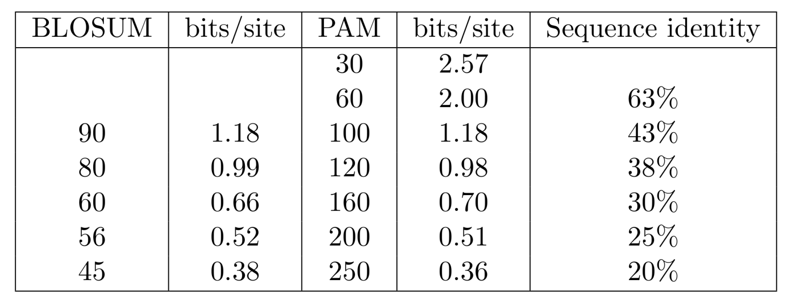

```{r, include=FALSE}
source("custom_functions.R")
library(flextable)
library(officer)

```

---
title: "Exercise sheet 6: BLAST"
---

---------------------------------

# Exercise 1

You are given accession number NM_000667.3. Use the [BLAST web server](http://blast.ncbi.nlm.nih.gov/Blast.cgi) to find
out about the gene that belongs to this acccession number (choose nucleotide blast, and the database RefSeq RNA).


### 1a)

Which gene is it, and in which organism?

#### {.tabset}

##### Hide

##### Solution

Gene: Alcohol Dehydrogenase 1A

Organism: *Homo sapiens* (human)

#### {-}


### 1b)

Which other organisms does it seem to be highly conserved in?

#### {.tabset}

##### Hide

##### Solution

- *Gorilla gorilla*: gorilla
- *Pan troglodytes*: common chimpanzee
- *Pan paniscus*: bonobo
- *Nomascus leucogenys*: northern white-cheeked gibbon
- *Cebus capucinus*: white-headed capuchin

Many more...

#### {-}

---------------------------------


# Exercise 2

We wish to find sequences related to a query sequence of 28 residues in a database of 1 billon residues. Since this sequence belongs to a highly conserved gene family, we decide to use the PAM30 matrix.


### 2a)

Does this query sequence provide enough information to find significant matches?

#### {.tabset}

##### Hide

##### Hint 1: scoring matrices

```{r, echo=FALSE, out.width="100%", fig.align='center'}

```

##### Hint 2: formulae

::: {.answer data-latex=""}
$$
Shortest\ reliable\ alignment = \frac{log2(mn)}{H^{N}}
\\
$$
:::

##### Solution 

::: {.answer data-latex=""}
$$
Shortest\ reliable\ alignment = \frac{log2(mn)}{H^{N}} = \frac{log2(28·10^{9})}{2,57}\simeq 14\ residues
\\
$$
:::

In that case, the query is long enough, since the minimum query length is 14 residues.

#### {-}


### 2b)

Our supervisor has asked us to find homologous sequences of a gene which belongs to a highly diverged gene family. In that case, we decide to use the PAM250 matrix, since it provides the best sensitivity. What are the implications of using PAM250 instead of PAM30, assuming that the query has a similar size?

#### {.tabset}

##### Hide

##### Solution

The information content of the matrix PAM250 is much lower than PAM30 (0,36 bits/site vs 2,57 bits/site). It has a direct impact in the information contained in the query. So, let's check it the query contains enough information to find significant matches:

::: {.answer data-latex=""}
$$
Shortest\ reliable\ alignment = \frac{log2(mn)}{H^{N}} = \frac{log2(28·10^{9})}{0,36}\simeq 96\ residues
$$
:::

Since the shortest alignment for which significance can be reliably is greater than the query size, it implies that a query size of 28 residues doesn't provide enough information. In order to solve the problem, we could try to use a longer query sequence, or use a smaller database.

#### {-}

---------------------------------

# Exercise 3

You are given a nucleotide query sequence $q$ =  $\texttt{ATAC}$, and a nucleotide database sequence $s$ = $\texttt{ATAAAACGGGGGG}$. The word-size $k=2$. Use a simple scoring scheme that assigns a score of $2$ for a match and a score of $-1$ for a mismatch.


### 3a)

Generate all $k$-length words of the query sequence.

#### {.tabset}

##### Hide

##### Solution

- $w_1=AT$
- $w_2=TA$
- $w_3=AC$

#### {-}


### 3b)

List all possible words for the first $k$-length word (AT) that have a score of at least $T_1=1$.

#### {.tabset}

##### Hide

##### Solution

- $s(AA)=1$
- $s(AC)=1$
- $s(AG)=1$
- $s(AT)=4$
- $s(CT)=1$
- $s(GT)=1$
- $s(TT)=1$

#### {-}


### 3c)

Scan the database for exact matches for the words from the question 3B.

#### {.tabset}

##### Hide

##### Solution

*AA* at position 2,3,4. *AC* at position 5, *AT* at position 0.

#### {-}


### 3d)

Extend the exact matches that you found in the question 3C to the left/right and report all MSPs with a score greater than $4$.

#### {.tabset}

##### Hide

##### Solution

AA:
```
Pos: 2              ATA
                    |||
                    AAA     with score 3
```
```
Pos: 3              ATAC
                    ||||
                    AAAC    with score 5
```
```
Pos: 4              AT
                    ||
                    AA    with score 1
```

AT:
```
Pos: 0              ATA
                    |||
                    AAA     with score 6
```

AC:
```
Pos: 5              AT
                    ||
                    AC     with score 1
```

MSPs start in the template at index 0 and 3.


### 3e)

What happens if we vary the parameters *k* and $T_1$?

#### {.tabset}

##### Hide

##### Solution

- Higher $T_1$, $k$: - faster (less seeds), - less sensitive (some hits will be missed)
- Lower $T_1$, $k$: - slower (more seeds), - more sensitive (less hits will be missed)

#### {-}

---------------------------------

# Exercise 4 - Programming assignment

For the programming tasks, please follow the instructions given in GitHub Classroom under the following link.


[https://classroom.github.com/a/nxAqfoYx](https://classroom.github.com/a/nxAqfoYx)


-------------------------------------------

```{r, include=knitr::is_html_output(), echo=F}
knitr::asis_output('Download: <a href="exercise-sheet-6.pdf" title="Download PDF Version">PDF Version</a> of this page.')
```

