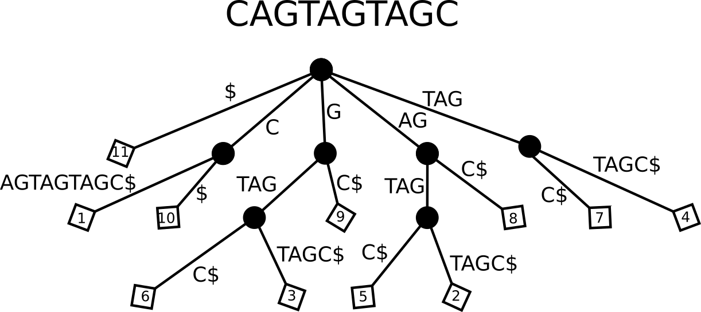
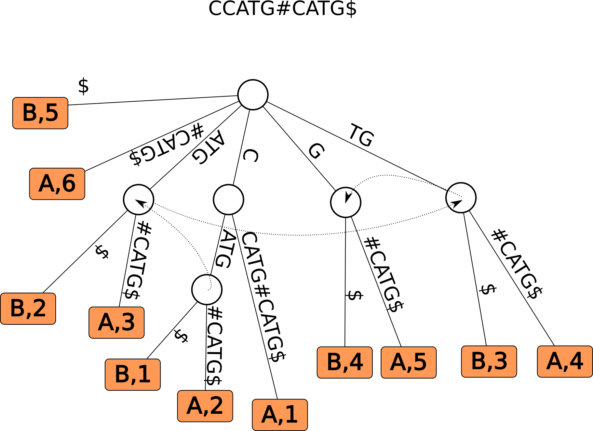
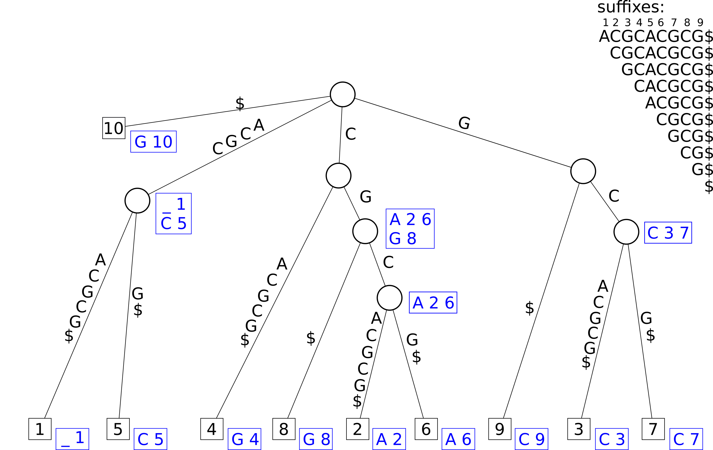

```{r, include=FALSE}
source("custom_functions.R")
library(flextable)
library(officer)

```

---
title: "Exercise sheet 8: Suffix-Trees"
---

---------------------------------

# Exercise 1

You are given the text T=`CAGTAGTAGC`


### 1a)

::: {.question data-latex=""}

Draw the corresponding suffix tree
::: 

#### {.tabset}

##### Hide

##### Solution
::: {.answer data-latex=""}

```{r, echo=FALSE, out.width="100%", fig.align='center'}

```
::: 

#### {-}


### 1b)
::: {.question data-latex=""}

Describe the steps of a counting query for $P =$ `TAG`
::: 

#### {.tabset}

##### Hide

##### Solution
::: {.answer data-latex=""}

* start at root node
* locate outgoing edge that starts with $T$
* match subsequent characters of the pattern
* in the subtree rooted at TAG count the number of leaves $\Rightarrow 2$
::: 
#### {-}


### 1c)
::: {.question data-latex=""}

Describe the steps of a reporting query for $P =$ `AG`
::: 

#### {.tabset}

##### Hide

##### Solution
::: {.answer data-latex=""}

* start at root node
* locate outgoing edge that start with $A$
* match subsequent characters of the pattern
* in the subtree rooted at AG report the labels of all leaves $\Rightarrow \{2, 5, 8\}$
::: 
#### {-}

# Exercise 2

### 2a)
::: {.question data-latex=""}

Draw a generalized suffix tree for the sequences $A=$`CCATG` and $B=$ `CATG`.
::: 

#### {.tabset}

##### Hide

##### Hint 1 
::: {.answer data-latex=""}

Concatenate the two sequences using a unique character for splitting. e.g.
`CCATG#CATG$`.

Dont forget to include suffix links 
::: 
##### Formulae
::: {.answer data-latex=""}

$sl(v) = w$

$\overline{v} = cb$

$\overline{w} = b$

$c: character, b: string$


remember: $\overline{v}$ denotes the concatenation of all path labels from the root to v.
::: 
##### Solution
::: {.answer data-latex=""}

```{r, echo=FALSE, out.width="100%", fig.align='center'}

```
::: 
#### {-}

### 2b)
::: {.question data-latex=""}

Find the Maximal Unique Matches of the sequences $A=$`CCATG` and $B=$`CATG` using 
the tree from A)
::: 

#### {.tabset}

##### Hide

##### Solution
::: {.answer data-latex=""}

`CATG` is the only MUM as $\overline{v} =$ `CATG` has no suffix links pointing to
it
::: 
#### {-}


# Exercise 3

### 3a)
::: {.question data-latex=""}

Draw a generalized suffix tree for the sequence $A=$`ACGCACGCG`.
::: 

#### {.tabset}

##### Hide

##### Solution
::: {.answer data-latex=""}

```{r, echo=FALSE, out.width="100%", fig.align='center'}

```
::: 

#### {-}


### 3b)
::: {.question data-latex=""}

Find all maximal pairs of length at least 2
::: 

#### {.tabset}

##### Hide

##### Solution
::: {.answer data-latex=""}

`ACGC`: $(1,5,4)$

`CG`: $(2,8,2), (6,8,2)$
::: 
#### {-}


### 3c)
::: {.question data-latex=""}

Why is `C`: $(2, 8, 1)$ not a maximal pair?

::: 

#### {.tabset}

##### Hide

##### Solution
::: {.answer data-latex=""}

It is not right maximal.
This can be seen since `CG`: $(2, 8, 2)$ already includes the indices 2 and 8 with
a longer match. 

::: 
#### {-}


